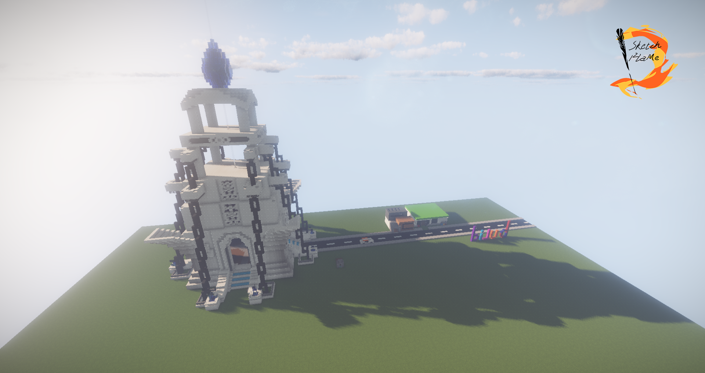
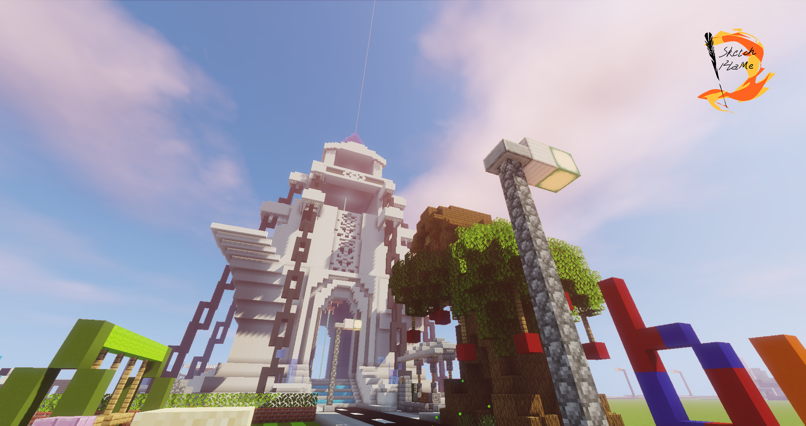
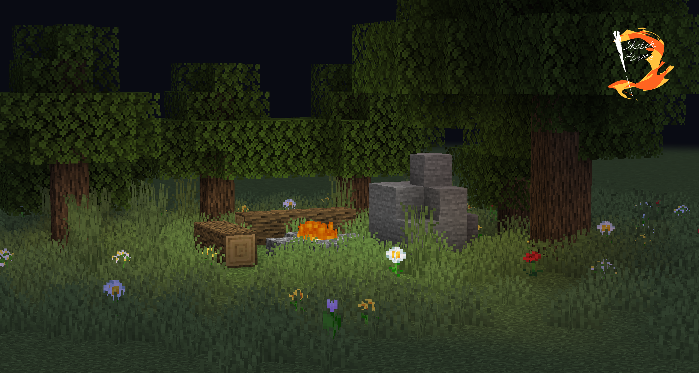
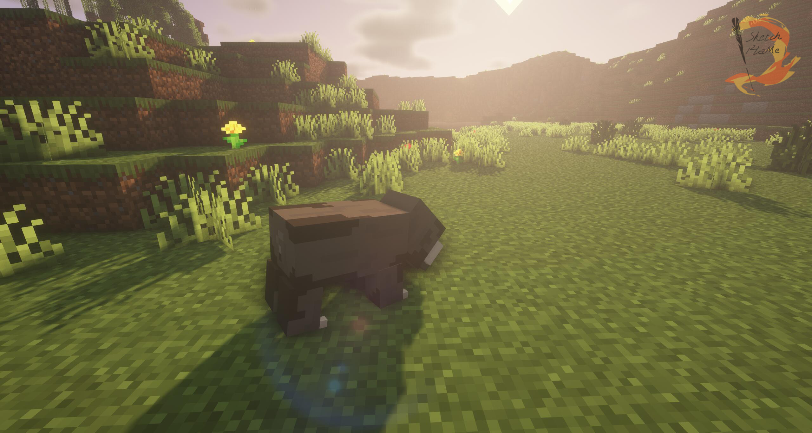

# 照片墙
## 2018年
### 8月

缤纷城(2018年8月23日)

### 12月

缤纷城(2018年12月9日)

## 2019年
### 2月

缤纷城-学校(2019年2月14日)

缤纷城-学校(2019年2月17日)

## 2020年
### 3月

缤纷城(2020年3月13日)

### 10月

缤纷城(2020年10月5日)

缤纷城(2020年10月18日)

## 2021年
### 10月

缤纷城-夜景(2021年10月3日)

## 2022年
### 4月

缤纷城-Time_White的生日贺图(2022年4月26日)

### 7月

缤纷城(2022年7月26日)

音域谷-野猪(2022年7月26日)

缤纷城-夜景(2022年7月30日)

