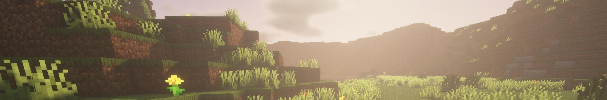

# 物品

## 音域谷
>
### 树枝

### 石块

### 纤维

### 麻绳

### 生猪排

### 生牛肉

### 猪皮

### 牛皮

### 骨头

### 野生浆果

### 石小刀

### 石手斧

### 橡木原木
 
### 苹果

### 简易工作台
### 磨制石料

### 橡木木材

### 木棍

### 石斧

### 石刀

### 石矛

#### 视频资料

<iframe src="//player.bilibili.com/player.html?aid=724262131&bvid=BV1GS4y1k7Xv&cid=518024269&page=1" scrolling="no" border="0" frameborder="no" framespacing="0" allowfullscreen="true"> </iframe>

### 木剑
#### 视频资料
<iframe src="//player.bilibili.com/player.html?aid=213240729&bvid=BV1Pa411v7Qh&cid=577640439&page=1" scrolling="no" border="0" frameborder="no" framespacing="0" allowfullscreen="true"> </iframe>

### 木铲

### 骨针

### 骨针与麻线

### 皮革帽子

### 皮革外套

### 皮革裤子

### 皮革靴子

### 营火
#### 视频资料
<iframe src="//player.bilibili.com/player.html?aid=513997359&bvid=BV1qg411175Z&cid=787824087&page=1" scrolling="no" border="0" frameborder="no" framespacing="0" allowfullscreen="true"> </iframe>  

### 熟猪排

### 牛排

### 烤苹果
### 烤牛肉串
### 烤猪肉串

## 缤纷城市区
>
### 矿泉水

饮用后，水份值增加35。
> “低廉价格的水，只需要拧开瓶盖即可饮用，味道平淡，细细品味后尚有一丝回甘。”

<strong>饮品</strong> 长按右键可以饮用该物品。

### 风味面包

食用后，回复5饥饿值和6饱和度。
> “缤纷城本地古法制作的风味面包，实现量产之后走向了大众，但味道却略逊手工制作的一筹。”

<strong>食物</strong> 长按右键可以食用该物品。

### 肾宝片
  

手持时按F使用，在40秒内保持耐力值回复，并提高耐力值的回复速度。（+1.6/s）
> “黑色纸盒包装的药片，拥有壮阳补肾之效，在男性群体中很有吸引力。”  

!> **消耗品**   
该物品为一次性使用的功能性物品！
### 砖块

* 攻击伤害:3
* 攻击速度:1.2  

> “粗糙的砖块，常见的建材，也可以用来打人。”

!> **材料**  
该物品可用于制作用途或交易。
### 窝窝头
  

食用后，回复2饥饿值和0.6饱和度，获得3秒的生命恢复I效果。
> “克罗诺斯的传统美食。其制作简单，价格亲民而广受好评，从而流传于各大城区，浓厚的粗粮香气是农家热情的象征。”

<strong>食物</strong> 长按右键可以食用该物品。

### 口香糖
  

手持时按F使用，在40秒内保持耐力值回复，并获得10秒速度I效果。40秒结束后吐出口香糖。
> “树胶制成的糖果，在口中咀嚼可以给人以愉快的心情，还能美白牙齿。其薄荷香气令人欲罢不能，令人可惜的是在口中咀嚼的过程中，香气会慢慢消失，不过，还请不要把嚼过的口香糖扔在大街上。”

!> **消耗品**   
该物品为一次性使用的功能性物品！
### 可乐

饮用后，水分值增加35，获得5秒的生命恢复I与5秒的速度I。
> “有奇妙味道的汽水。原本是用于医药的药水在意外之下成为了无比畅销的饮料，半透明黑红色的汽水涌入口腔的直冲脑门，要是冰镇过那就更是美味了。”

<strong>饮品</strong> 长按右键可以饮用该物品。

### 冰红茶

饮用后，水分值增加35，获得5秒的跳跃提升I与5秒的力量I。
> “柠檬味的甜红茶。用砂糖煎出香味后，再用清水煮沸的红茶用柠檬与冰块浸泡。香甜而又有柠檬香的风味，同样适合冰镇饮用。”

<strong>饮品</strong> 长按右键可以饮用该物品。

### 奶茶

饮用后，水分值增加35，获得5秒的抗性提升I与5秒的夜视I。
> “牛奶与红茶搅拌而成的饮品，醇厚的牛奶与红茶液交织，因其快速便捷的包装而风靡缤纷城。”

<strong>饮品</strong> 长按右键可以饮用该物品。

### 南瓜饼

食用后，水分值减少5，回复8饥饿值和4.8饱和度。
> “南瓜煎制而成的甜点，南瓜的香气十足，入口有细细的甜味。”

<strong>食物</strong> 长按右键可以食用该物品。

### 咸牛肉

食用后，水分值减少16-17，回复8饥饿值和12.8饱和度。
> “风味十足的牛肉干，拆开包装后牛肉上的盐粒清晰可见……不过还是要配一杯水才方便入口啊。”

<strong>食物</strong> 长按右键可以食用该物品。

!> 提示：请配水食用!
### 创可贴

手持时按切换副手键使用，获得瞬间治疗II与20秒的生命恢复I。
> “实用的道具，常用于受伤后的临时医疗。家常必备，跌打破皮止血治疗专用。”

!> **消耗品**   
该物品为一次性使用的功能性物品！

### 进口矿泉水

饮用后，水分值增加40，获得5秒的水分充足。
> “水源来伊芙萝拉林间的矿泉水，据说有特异的功效和味道，再配上高昂的价格，在富人圈中成为了必不可少的物品……希望这瓶水真的去过伊芙萝拉。”

<strong>饮品</strong> 长按右键可以饮用该物品。

### 咖啡

饮用后，水分值增加25，耐力值增加20。
> “咖啡豆粉冲泡后的饮品，提神醒脑，入口苦涩，已经与现代生活、时尚、工作休闲娱乐联系在一起，被誉为“刷锅水”。呜哇……这种味道谁接受的了啊……”

<strong>饮品</strong> 长按右键可以饮用该物品。

### 含糖咖啡

饮用后，水分值增加20，耐力值增加20，获得10秒的速度I。
> “咖啡加糖，其苦涩味削减了许多，贴合了大众的口味。”

<strong>饮品</strong> 长按右键可以饮用该物品。

### 能量饮料

饮用后，水分值增加35，耐力值增加15，获得10秒的跳跃提升I、10秒的速度I、10秒的力量I、10秒的急迫I。
> “补充能量的饮料，富含维生素、牛磺酸等物质,运动人士极为喜爱。”

<strong>饮品</strong> 长按右键可以饮用该物品。

### 鲜榨果汁

饮用后，水分值增加35，获得10秒的生命恢复II与10秒的夜视。
> “罐装果汁，入口甘甜，果味十足，但“鲜榨”……没怎么尝出来吧。厂商事后声明：“鲜榨果汁”只是品牌名。”

<strong>饮品</strong> 长按右键可以饮用该物品。

### 啤酒

饮用后，水分值增加35，酒精度增加35。
> “小麦酿造而成的酒，适合酒量不太好的人饮用，聚会、烧烤中必不可少。”

<strong>饮品</strong> 长按右键可以饮用该物品。

### 柠檬水

饮用后，水分值增加35。
> “混合柠檬汁的水，入口酸甜，很适合夏天解暑。”

<strong>饮品</strong> 长按右键可以饮用该物品。

### 进口冰川水

饮用后，水分值增加150，获得30秒的水分充足。
> “来自奥林匹斯山脉的冰川融水，价格奢侈。资本主义的包装能激起人们的狂热。”

<strong>饮品</strong> 长按右键可以饮用该物品。

### 威士忌

饮用后，水分值增加35，酒精度增加65。
> “一种烈性蒸馏酒，起源于伊芙利特，被称为秘斯塔尔人的“生命之水”。”

<strong>饮品</strong> 长按右键可以饮用该物品。

### 伏特加

饮用后，水分值增加35，酒精度增加115。
> “萨特浮施特产酒，卡厄罗斯的气候极端寒冷，人们便用这种酒御寒，当地人称为「生命」，96%的酒精注定伏特加无法被多数人接受，甚至被暴徒用在制作燃烧瓶上……”

<strong>饮品</strong> 长按右键可以饮用该物品。

### 利奇菲尔德

饮下此酒，来自西部开拓者的力量降临于身，似乎继承了一代神枪手的射术。饮用后，水分值增加45，酒精度增加75，获得1分钟的力量II与1分钟的速度II。
> “秘斯塔尔产的调制酒，由威士忌为酒基，散发出金黄色，名字来源于秘斯塔尔第一代管理者零七的真名。§r§f利奇菲尔德·卡斯提里斯出身伊芙利特新贵族，后来成为了一名资产阶级革命家。他率领起义军撤出伊芙利特，建立了秘斯塔尔共和联邦，起自己代号为「零七」。他热衷饮酒，据传，威士忌和白兰地都是他命令部下酿造的烈酒。作为一代神射手，他在醉酒时可以迅速拔出左轮枪，打落天上的六只飞鸟，他的枪法极准，射击技术堪称为「死神之眼」。”

<strong>饮品</strong> 长按右键可以饮用该物品。

### 蓄电池特饮

饮用后，水分值增加250，获得1分钟的跳跃提升II与1分钟的速度III。
> “弗兰肯斯特产饮料。将各种化学调味剂与果汁配成的饮料以直流电通过后，能焕发不一样的美味。位于大陆南方的弗兰肯斯，拥有最强的科技生产力水平，制造业也是极其发达。弗兰肯斯第一任管理者弗朗西斯曾主张通过当时崭新的科学技术改善人们的生活水平，在当时掀起了“饮食革命”的浪潮，食品制造业生产总值一路攀升。其中，蓄电池特饮是弗朗西斯钟爱的一款饮料，小小的一瓶饮料，象征了弗兰肯斯早期开拓者改造自然的精神。蓄电池特饮如今已成为弗兰肯斯知名品牌饮料，售价昂贵，给人以电流般的刺激与振奋的精神。”

<strong>饮品</strong> 长按右键可以饮用该物品。

### 集市葡萄酒

饮用后，水分值增加35，酒精度增加35，获得1分钟的伤害吸收III与1分钟的生命恢复II，同时2分钟内，攻击力+4,护甲值+4。
> “奥林匹斯教会祭祀神明所用的酒，装于铅酒杯之中，尊贵无比。据传，奥林匹斯的管理者杰洛特行军至山脚下，令手下民众采集葡萄酿造果酒。在她征服各邦，统一山脉后，与部下开设三天三夜的酒宴。此后，葡萄酒传入民间，成为了奥林匹斯城平民与贵族生活中必不可少的一部分。祭神用酒为葡萄酒中上品中的上品，喝下此酒，能御神力降身。”

<strong>饮品</strong> 长按右键可以饮用该物品。

### 浮空城汽水

饮用后，补满水分值，且在接下来的2分钟内，水分值上限+25%。同时，获得10秒的漂浮IV与16秒的缓降。
> “克罗诺斯售卖的限量版汽水。在入海口上空悬浮在高空的岛屿群，被称为克罗诺斯群岛。克罗诺斯自由城坐落其上，故而被称为「浮空城」。传说中，克罗诺斯第一代管理者白白在先人的指引中启动克罗诺斯群岛，继承了其控制时间的力量，成为第一代克罗诺斯城主。此后的几百年，克罗诺斯欣欣向荣——引入的汽水是这座城市自由开放的象征。喝下一瓶浮空城汽水，仿佛全身轻盈起来，即便是平步青云也不在话下。”

<strong>饮品</strong> 长按右键可以饮用该物品。

### 精灵咖啡

饮用后，水分值增加35，耐力值增加60，获得1分钟的",潮涌能量与1分钟的海豚的恩惠，同时2分钟内，处于",及水状态时，获得抗性提升和隐身。
> “伊芙萝拉精灵一族以古老秘方炼制的咖啡饮料，灌注以水属性魔力。咖啡起源于伊芙利特，是由咖啡豆磨粉制作出的饮料。当时的贵族流行在特殊日子互送咖啡豆以示尽情狂欢，或是给久未谋面的亲友，有财入袋、祝贺顺遂之意，同时也是身份地位象征。精灵咖啡是咖啡中极为稀有的昂贵的一种，喝下咖啡获得亲水性，可遁入水中自由移动而不显身形。”

<strong>饮品</strong> 长按右键可以饮用该物品。

### 曲奇

### 培根
### 鳕鱼片
### 杂烩肉汤
### 炸鸡
### 金苹果

### 熏三文鱼
### 金胡萝卜

### 西部燕麦饼

### 量子压缩能量棒

### 宫原烤肉

### 神圣金苹果

### 咸鱼

### 甜辣味海水

> “又甜又辣的苏打水，由莫托洛夫食品厂生产，辣味其实是强效薄荷精华的味道，虽然名字怪异，但只要尝试过就再也停不下来……目前缤纷大陆地区仅售原味。”
### 奇怪的花

### 菜刀

### 珍珠奶茶

### 椰果奶茶

### “无限加料！”

### 棱晶水

### 灭火器

#### 视频资料

<iframe src="//player.bilibili.com/player.html?aid=682902728&bvid=BV1RS4y1A7Ue&cid=568147604&page=1" scrolling="no" border="0" frameborder="no" framespacing="0" allowfullscreen="true"> </iframe>

## 奥林匹斯
### 云杉原木
### 云杉木材
### 石头
### 圆石
### 泥土
### 沙子
### 沙砾
### 羽毛

### 燧石

### 松果
### 干草
### 野生小麦种子

### 野生胡萝卜

### 云杉树叶
### 生鸡肉

### 生羊肉

### 烤鸡肉

### 烤羊排

### 烤鸡肉串
### 烤羊肉串
### 腐肉

### 蛛丝

### 铜矿
### 铁矿
### 煤炭
### 锡矿
### 银矿
### 金矿
### 铅矿
### 石钳
### 石砧
### 石制冶炼炉
### 简易鼓风机
### 铜锭
### 铁锭
### 锡锭
### 金锭
### 银锭
### 铅锭
### 青铜锭
### 琥珀金锭
### 钢锭
