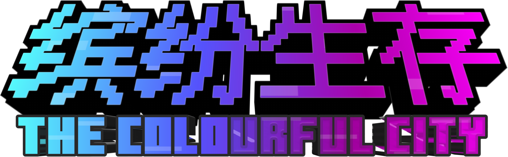
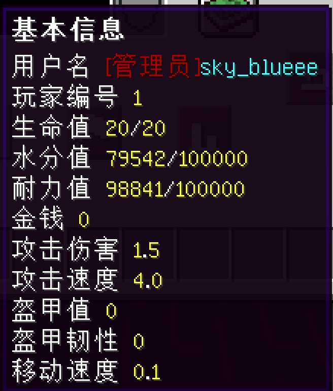
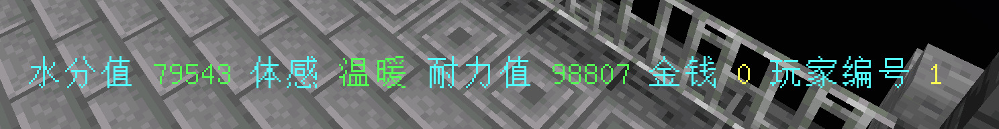
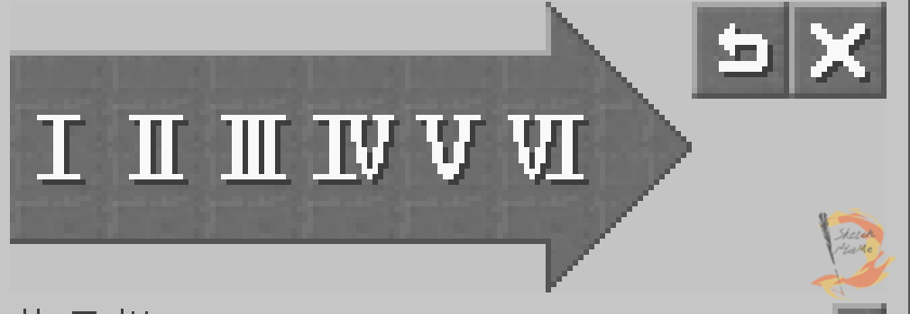
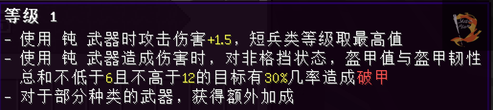
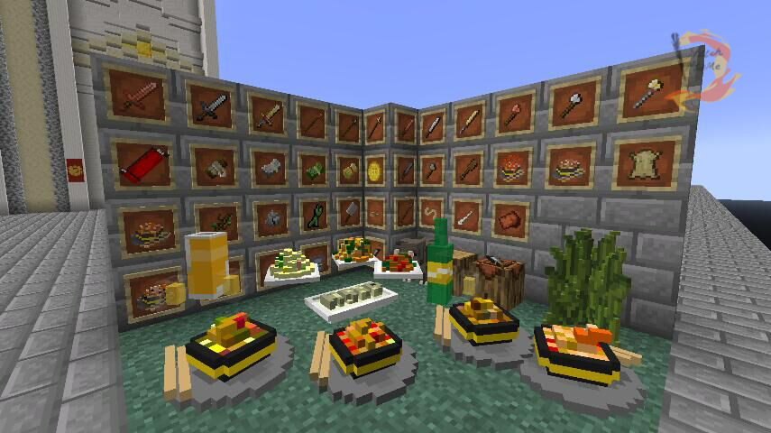
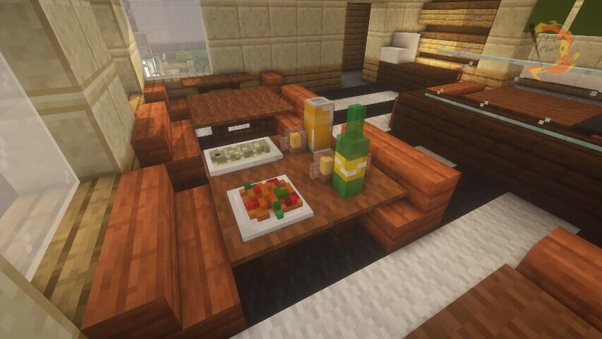
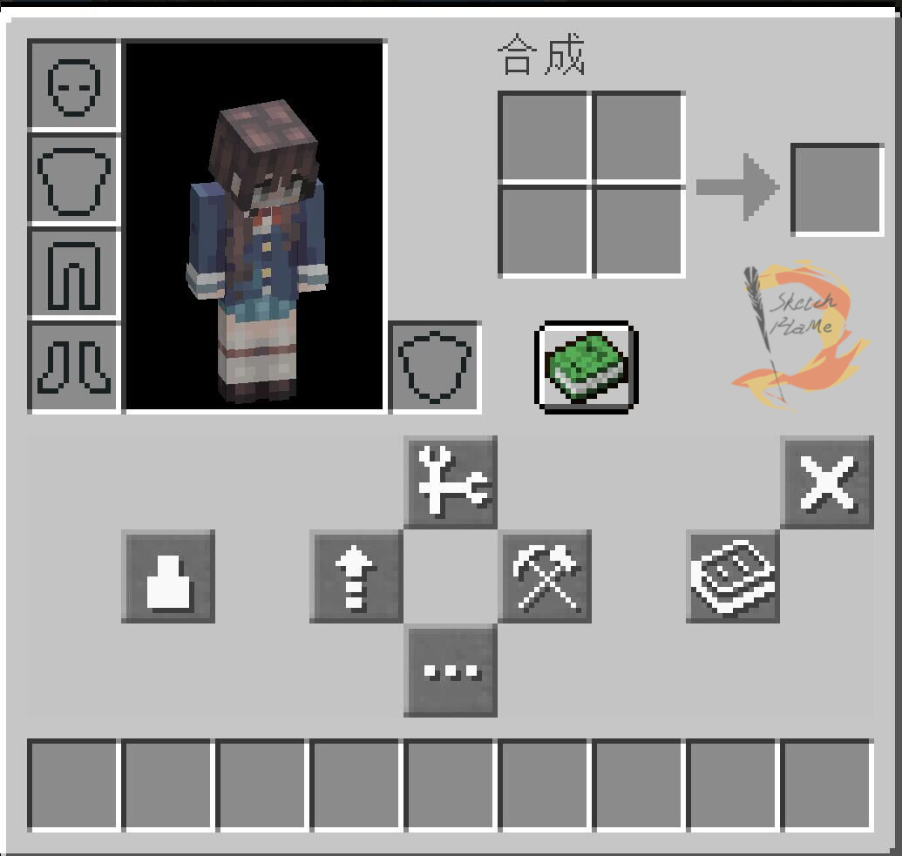
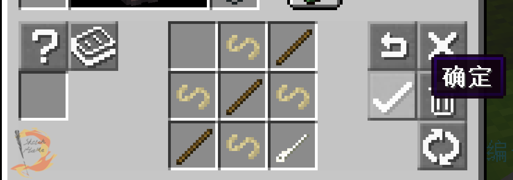
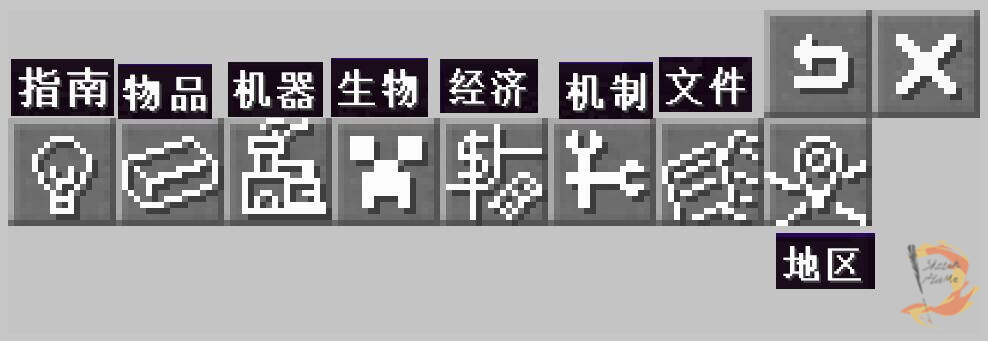

# 缤纷生存(The Colourful City)
 
**缤纷生存（The Colourful City，简称CC）由SketchFlaMe在2018.8.15开始由Minecraft原版为基础制作的综合性原版服务器，玩法以开放世界生存为主；基本玩法的灵感来源于《模拟人生》和一款叫做《我的幻想2》（MineFantasy2）的mod，但是却具有较为独特的玩法。**

## 项目介绍
**在未来的企划中，正式版的缤纷生存将会具有八个有独立维度的城区，数十个副本。具有八个城区的基础[物品](zh-cn/物品/1.md)、生物与系统，数十个副本。玩家在六个生存主线城区中，将会从零体验从石器时代、铁器时代、近代、现代和未来生存阶段的科技树；同时，在世界观“缤纷大陆”的八个城市中也能体会到开放世界风土人情的体验。**

**在缤纷生存中，原版的生存方式被彻底修改，几乎所有原版生存机制被废除，因此玩家以冒险模式生存；**
**缤纷生存通过数据包，更改了玩家的基础属性，**分为：生命值、饥饿值、水分值、耐力值、体感、金钱、玩家编号、魔力值等；同时，在原版盔甲值、盔甲韧性的基础上，添加了各种类型的物理、化学、魔力、辐射等伤害类型，同时添加了防御力、魔力抗性、化学抗性、辐射抗性、耐力消耗、绝缘性、防弹性、负重等由装备或等级带来的隐性属性。同时，缤纷生存充分利用地图中的物品，添加了辛辣度、酒精度等食物/饮料带来的属性。

**缤纷生存添加了一套独特的等级系统，**将等级分为技术、开采、战斗、学术、魔力、体力六类（beta1.0中，添加了四类），对于六个大类的等级，也有进行属性细分；
例如：战斗→短兵等级，就分为长、短、重、轻、锐、钝六种，各个等级对于符合属性的武器进行强化和补充，极大地扩充了冷兵器作战的多样性。
在第二阶段（预计beta2.0）中，武器、工具模板就有十几种，如刀、剑、枪、矛、战斧、战锤；短弓、长弓、十字弩等。各种武器通常具有攻击、格挡、重击等功能，使用武器也会消耗耐力值。除了常规武器，缤纷大陆的各个城区也有区域的特色独一无二的武器：这些武器会随着玩家的游戏流程不断增强。

**在beta1.0版本中，缤纷生存添加了80余种[物品](zh-cn/物品/1.md)；**在接下来的版本更新中，物品种类会不断增加；

## 关于食物
厌倦了原版的寥寥的物品形式食物？想要到一家特色的餐馆品尝一道炒面？甚至想要自己架设一口锅炒菜？**缤纷生存提供了丰富的饮食机制和数十种食物与饮料，**同时根据食物的性质提供各种各样的属性变化；缤纷生存的食物不拘泥于仅仅是添加药水效果等功能——干燥的食物会减少水分值、生的食物会让玩家生病以及减少耐力值、汤类食物会恢复水分值、辛辣的食物会增加辛辣度……同时，“增加水分值/体力上限”“水分充足”“提升攻击力”“减少耐力消耗”“提升远程武器精准度”“亲水性”等独特效果，做到游戏整体玩法的最大匹配。同时，每个城区都设有餐馆，玩家可以花费一定金钱购买菜品，并在餐馆订下一个桌位，坐下来品味一桌的美食；玩家也可以在野外设立篝火，架起大锅，自己制作独特的美食——在缤纷生存中，总有一种食物适合你。

## 关于资源的开采
对于资源的开采，**缤纷生存添加了许多独特的地物，**这些地物通常具有独立模型，随机生成在副本中，并且有各种各样的掉落物和性质。对于地物的交互与破坏，也有各种各样的内容——比如火焰会烧毁草丛与树木，灭火器可以熄灭火焰等等。
## 关于方块、机器、UI
**缤纷生存在玩家的背包中添加了一套菜单系统，**很好地贴合了原版的美术风格；在菜单中，玩家随时可以查看个人信息、查看等级经验、进行合成制作、查看图鉴，以及游戏设置等功能。
对于方块、机器，采取了类似方舟生存进化式的放置方法，许多机器都绘制有GUI，尽可能最大化利用了原版的物品栏、矿车、木桶等UI。

## 关于生物
**对于生物，**缤纷生存打破了以往原版模组借用原版生物AI，或是单纯修改材质的做法，而是利用Blockbench的AnimatedJava插件设计动画，对每个生物设计了独特的动作；同时，每个生物的AI都由数据包进行编写，在优化方面也尽量做到优秀。同时，每种生物都具有各种不同的数值，很好地利用了缤纷生存庞大的各类显性或隐性属性。

## 关于教程
害怕内容太多，无法入手？**缤纷生存的图鉴提供了游戏全流程的指南，**对于各个阶段所经历的生存流程进行了详细的介绍；同时，游戏具有新手引导，利用原版的进度，也达到了很好的对游戏内容引导的作用。图鉴中还覆盖了物品、机器、生物、地物、经济、机制、文件、地区的介绍，保证玩家在游玩过程中尽量不一头雾水。直觉化的游戏设计也能让玩家在机制大改的情况下，做到减少陌生感，增加新鲜感。

###### 备注
(在该wiki，可以查看缤纷生存目前具有（或是已制作完成，计划实装）的新游戏内容。)

(目前的缤纷生存处于beta阶段，预计beta阶段未来还有六个大版本，分别包含生存科技树的一个阶段。)